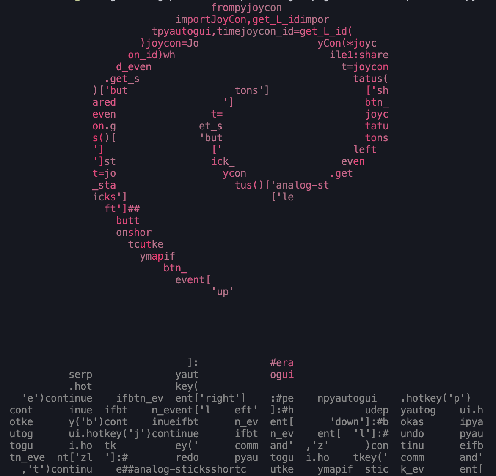
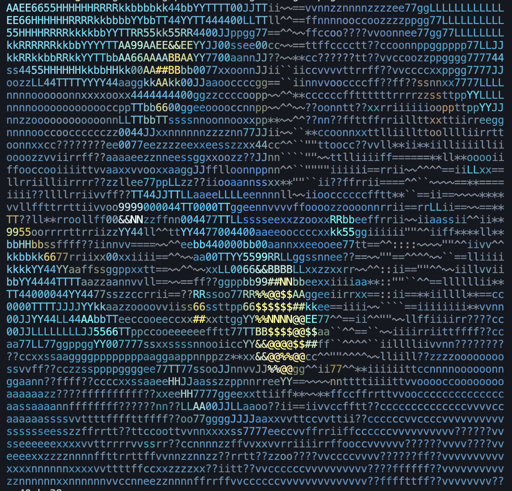

# pixii (ASCII Art Generator)

This is a command line tool to convert an image into color ASCII art.
It resizes the image and replaces each pixel with the corresponding ASCII character according to its brightness.
It can also be applied to an image using a string in a text file.

__sample__
<div style="display: flex;">
  
  
</div>

<br><br>

## Prerequisites
```
ansi_term = "0.12.1"
clap = { version = "4.3.0", features = ["derive"] }
image = "0.24.6"
```

## Usage


1. Clone the repository:

```bash
git clone https://github.com/imoken1122/pixii.git
```

2. Build th project

```
cd pixii
cargo build --release
```

3. Generate Ascii-Art


```
./target/release/pixii -i <image_path> [OPTIONS]
```

__Command-Line Options__

- -i, --image <PATH>: Specify the path to the input image file (required).
- -x, --width <RESIZE_WIDTH>: Specify the desired width for resizing the image.
- -y, --height <RESIZE_HEIGHT>: Specify the desired height for resizing the image.
- -r, --ratio <RESIZE_RATIO>: Specify the resize ratio for resizing the image (0 < ratio < 1).
- -t, --text <PATH>: Specify the path to a text file for generating ASCII art from custom characters.


__Note: Resizing Options__

When resizing the image, you have two options: specifying the width and height separately or specifying a resize ratio.

__Width and Height__: Specify either the width or the height, and the other dimension will be adjusted proportionally to maintain the original aspect ratio.

__Resize Ratio__: Specify a resize ratio, and both the width and height will be resized by the same ratio while maintaining the original aspect ratio.


## Example


Resize the image to a specific ratio:
```
./target/release/pixii -i images/image1.png -r 0.5
```

Resize the image to a specific width:

```
./target/release/pixii -i images/image1.png -x 40
```

Resize the image to a specific heigh:

```
./target/release/pixii -i images/image1.png -y 40
```

Convert image to ascii-art using text file strings

```
./target/release/pixii -i images/image1.png -t text.py
```